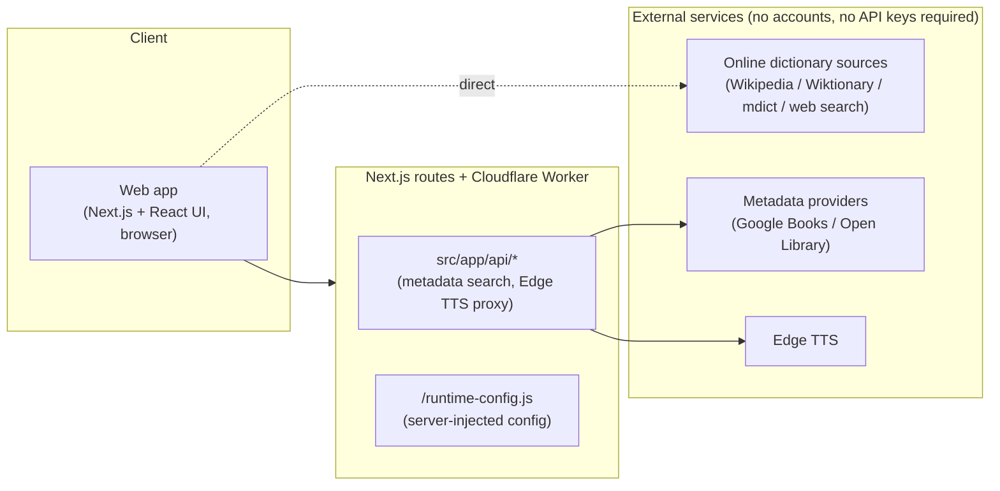
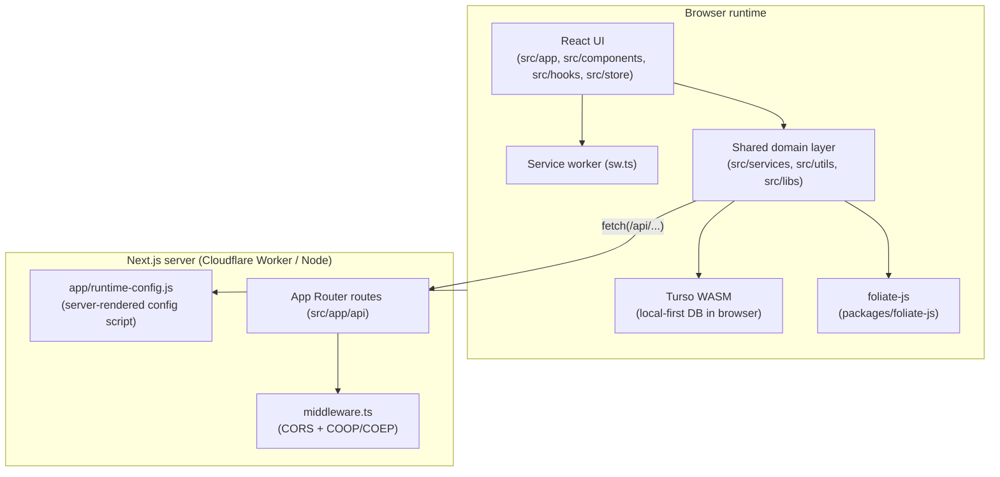
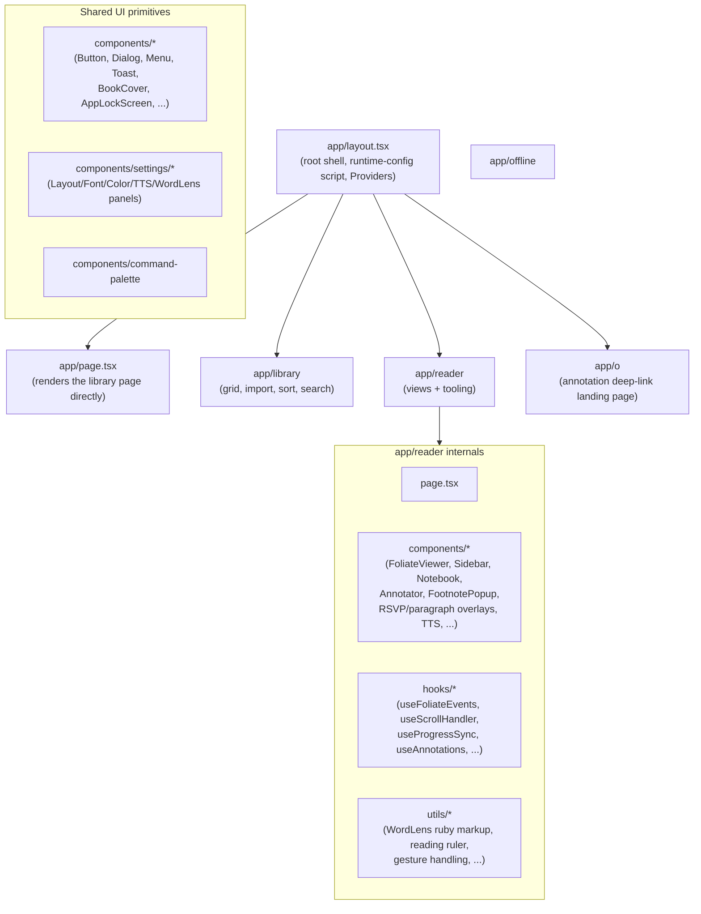
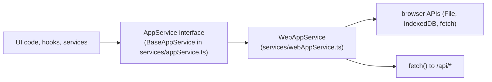
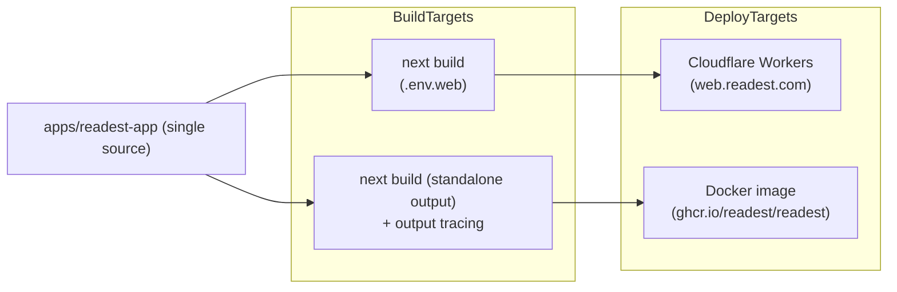

# Readest Architecture

This document gives a system-level view of Readest: how the pieces fit together,
which side of the wire each piece runs on, and what each module is responsible
for. It complements [`code-layout.md`](./code-layout.md), which focuses on the
directory layout. Read this one first if you want to understand the system; read
that one when you need to find a specific file.

Readest is now **web-only and local-only**: a single Next.js 16 / React 19 app
deployed to Cloudflare Workers (or self-hosted via Docker), with no account
system, no cloud sync, and no third-party integrations. There is no desktop or
mobile build — the Tauri native shell, the Android/iOS apps, and Apple/Google
IAP were removed from this fork. Beyond that, a large second cleanup pass
removed the AI assistant, translation providers, Hardcover/Readwise, all forms
of cloud/file sync, OPDS/RSS/web-novel import, "Send to Readest", and public
book sharing — along with the entire Supabase auth/Stripe billing system that
gated them. What's left is unashamedly simple: a book stays on the device that
imported it, read with the same reading engine, reading aids, and local
annotations as before.

A handful of source files still contain dead branches left over from the
Tauri removal (checks like `isTauriAppPlatform()` that are now hardcoded to
`false`, or imports of `@tauri-apps/*` packages); those are called out below
where they matter so they aren't mistaken for live behavior. A smaller number
of files still reference the more recently removed subsystems (an `opds`
proxy route, an `OPDSCatalog` type, an `'integrations'` string union that still
lists `hardcover`/`readwise`/`opds`) — these are inert leftovers of that
cleanup, not documented below as features, and are expected to be swept up by
follow-on dead-code removal.

The diagrams use [Mermaid](https://mermaid.js.org/) and render natively on
GitHub.

## 1. High-level picture



Everything that used to fan out to Supabase, S3/R2, Stripe, AI providers,
translation providers, OPDS catalogs, Hardcover, Readwise, and BookOrbit is
gone. The only two server routes left are a metadata lookup proxy and an Edge
TTS proxy, and neither requires a signed-in user — both are open endpoints
that exist purely to keep API calls off the client (CORS, hiding no secret in
the TTS case) rather than to gate a paid feature.

The `Backend` box is deployed as a Cloudflare Worker via `@opennextjs/cloudflare`
and `wrangler.toml`, or as a standalone Next.js server inside the Docker image
(`Dockerfile`, `docker/` at the repo root).

## 2. Process boundaries

There are two runtimes in play:



Two things are worth calling out:

`middleware.ts` sets CORS headers on `/api/*`, plus
`Cross-Origin-Opener-Policy: same-origin` and
`Cross-Origin-Embedder-Policy: require-corp` on every document response.
Cross-origin isolation is what exposes `SharedArrayBuffer`, which the Turso
WASM thread pool needs; without it `initThreadPool` hangs. There is no longer
a path-specific COEP exception (the old `credentialless` carve-out existed
only for the now-deleted public share landing page's cross-origin book cover).

`/runtime-config.js` is a server route (`src/app/runtime-config.js/route.ts`)
that emits `window.__READEST_RUNTIME_CONFIG = {...}` as a JavaScript file. It
is loaded as a `<script>` tag from `app/layout.tsx` and `pages/_document.tsx`.
The config is now tiny — just `apiBaseUrl` and `fontBaseUrl` (the latter lets a
self-hosted deployment on a custom domain point at its own CJK webfont CDN
instead of Readest's, since that CDN only answers CORS for `readest.com`
origins). The old fields (`supabaseUrl`, `supabaseAnonKey`, storage/translation
quotas) went away along with auth and billing.

## 3. Frontend architecture

The frontend is a Next.js 16 + React 19 app. It still uses both routers, but
the split is much smaller now:

| Concern | Lives in | Why |
|---|---|---|
| Library, reader, annotation deep-link pages | `src/app/*` (App Router) | Standard for new pages; supports server components and the runtime-config route. |
| Reader entry by ID list `/reader/:ids` (rewritten to `/reader?ids=...`) | `src/pages/reader/index.tsx` (Pages Router) | Historical entrypoint; coexists with the App Router reader. |
| Cross-origin isolation document shell | `src/pages/_document.tsx` | Pages Router still owns `<Document>` for COOP/COEP and `runtime-config.js`. |
| HTTP API endpoints | `src/app/api/*` only | `src/pages/api` is now empty — every route that lived there (sync, storage, send, DeepL, BookOrbit, user/account) was deleted with its feature. |

### 3.1 UI module map



The biggest UI cluster is `app/reader`: roughly 30 components and 30 hooks
coordinating Foliate-based rendering, annotations, footnote popovers, the
notebook side panel, parallel view, RSVP, WordLens vocabulary glosses, search,
TTS, and the settings panels under `components/settings`. There is no AI/chat
UI anywhere in the tree — the "Reedy" assistant and its `AIPanel`/`aiChatStore`
were removed, not just disabled.

`app/o` is what's left of the sharing feature's deep-link machinery: exporting
a highlight/note to Markdown embeds a link back to it
(`/o/book/<hash>/annotation/<id>`, built by `src/utils/deeplink.ts`). The page
tries an Android/iOS app-intent handoff first — dead on this web-only fork,
since there's no native app to hand off to — then falls back to opening the
book in this web reader at the saved CFI, which is the path that actually
works. See section 6.6.

### 3.2 State (Zustand)

Frontend state is split across single-purpose Zustand stores in `src/store`.
Each store maps to a clearly delimited concern:

```
libraryStore        -> books, folders, selection, sort
bookDataStore       -> per-book data (TOC, annotations, locations)
readerStore         -> active views, layout, ribbon state
readerProgressStore -> reading progress tracking
parallelViewStore   -> two-pane reading
notebookStore       -> notebook side panel
settingsStore       -> user/app settings
themeStore          -> light/dark/atmosphere
sidebarStore        -> sidebar visibility/width
appLockStore        -> app PIN lock
proofreadStore      -> proofread side flow
atmosphereStore     -> ambient overlay
customDictionaryStore / customFontStore /
  customTextureStore                         -> user-imported assets
```

Every store that only existed to support a deleted feature (`aiChatStore`,
`feedStore` for RSS, `fileSyncStore` for WebDAV/S3, `transferStore` for
cloud upload/download, `customOPDSStore`) is gone.

### 3.3 In-browser book engine

EPUB / MOBI / KF8 / FB2 / CBZ / TXT / PDF parsing and rendering is **not**
hand-rolled in this repo. The reader sits on top of `packages/foliate-js`, a
forked copy of the Foliate JS engine. Readest's reader code in `app/reader` and
the adapters under `src/services/annotation`, `src/services/nav`,
`src/services/transformers`, and `src/services/rsvp` wrap that engine and add
features (annotations, navigation, content transforms, vertical/Warichu
support, classic mode overlays, etc.).

PDF rendering goes through `pdfjs-dist`, which is copied into
`public/vendor/pdfjs` at build time (`pnpm setup-pdfjs`). Chinese conversion
uses `simplecc-wasm` (`public/vendor/simplecc`), and Chinese segmentation uses
`jieba-wasm` (`public/vendor/jieba`).

### 3.4 Service worker and offline

`src/sw.ts` is a Serwist service worker that gives the web build offline
support: cached static assets, cached API responses for read-only data, and an
offline route at `/offline`.

## 4. The platform abstraction (`AppService`)

`src/services/appService.ts` defines the `AppService` interface (`BaseAppService`
abstract class) that domain code uses for anything platform-shaped: local
file access, dialogs, dir scanning, database bootstrap, etc. There is exactly
one concrete implementation:



`environment.ts` still exposes `getAppService()` / `getInitializedAppService()`
as the seam callers use (`useEnv().appService`), but it now unconditionally
resolves and caches a `WebAppService` singleton — `isTauriAppPlatform()` is a
hardcoded `() => false` and `isWebAppPlatform()` is a hardcoded `() => true`.
`nativeAppService.ts` and `nodeAppService.ts` (the Tauri and Node
implementations) are gone from the tree.

`BaseAppService` itself still carries several Tauri-era defaults —
`appPlatform: AppPlatform = 'tauri'` (overridden by `WebAppService`), `hasIAP`,
`distChannel`, `storefrontRegionCode` — inherited from before this fork's
cleanup. They're vestigial: nothing but `WebAppService` extends the class, so
in practice `appPlatform` is always `'web'` and IAP fields are always unused.

The same pattern shows up in `src/services/database`: only
`webDatabaseService.ts` (browser, via Turso WASM) is wired up at runtime.
`nodeDatabaseService.ts` (a `DatabaseService` backed by
`@tursodatabase/database`, Node-native) still exists but has no current
caller — the bench scripts under `bench/` talk to `@tursodatabase/database`
directly instead of going through it. `nativeDatabaseService.ts` (the former
Tauri/`tauri-plugin-turso` implementation) is gone. All surviving
implementations share `migrate.ts` and `migrations/*`. See section 6.1 for why
none of this touches the fact that Turso WASM is still the app's one and only
datastore.

A few other modules still import `@tauri-apps/*` packages or branch on
`isTauriAppPlatform()` even though that branch can never be taken here — they
were not deleted in this fork's cleanup because they don't break the build,
just add unreachable code. The clearest examples:

- `src/services/tts/NativeTTSClient.ts` and `NativeAudioPlayer.ts` — native
  TTS / in-process audio for Tauri iOS. `wordPronouncer.ts`, `BufferedTTSClient.ts`,
  and `EdgeTTSClient.ts` still branch toward them on `options.appService?.isMobile`
  or platform checks that are always false on web.
- `src/utils/settingsSync.ts` — cross-window settings broadcast for
  Tauri's multi-window desktop mode, using `@tauri-apps/api/event` /
  `getCurrentWindow`; there is only ever one window on web, so this never runs.
- `src/services/tts/mediaOverlay/NativeNarrationPlayer.ts`,
  `src/services/dictionaries/systemDictionary.ts`, `src/services/nav/index.ts`,
  `src/services/annotation/providers/foliate.ts`, and a number of files under
  `src/utils` (`open.ts`, `clipboard.ts`, `file.ts`, `path.ts`, `window.ts`,
  `bridge.ts`, `iap.ts`, `tauriEpubBridge.ts`, `tauriMobiBridge.ts`,
  `transfer.ts`) — smaller Tauri-only branches following the same pattern.

None of this blocks anything — it's dead-but-harmless — but don't take an
import of `@tauri-apps/*` or a `NativeXyz` class name as evidence that native
platform support still exists.

## 5. Backend (Next.js routes)

`src/pages/api` is now empty; every route that used to live there (KOReader
sync, replica sync, S3/R2 storage, "Send to Readest" inbox, DeepL, BookOrbit,
account deletion) was deleted along with its feature. All that's left lives
under `src/app/api`:

```
metadata/search          -> metadata lookup (Google Books / Open Library)
tts/edge                 -> Edge TTS streaming
```

Both are unauthenticated — there is no session/user concept left to check.
They exist as thin server proxies (CORS, and for TTS, hiding no secret) rather
than as gated, paid features. (`app/api/opds/proxy` also still exists on disk;
it has no caller anywhere in the UI — `src/services/opds` and `src/app/opds`
are both gone — so treat it as leftover dead code from the OPDS removal, not a
live route.)

### 5.1 Workers

`apps/readest-app/workers/send-email` (a Cloudflare Worker for the "Send to
Readest by email" path) and `extensions/send-to-readest` (the companion
browser extension) still exist as source trees, but the feature they served
is gone — `src/services/send`, the `/api/send/*` routes, and the `app/send`
UI were all deleted. Neither has a live counterpart to talk to on this fork.

### 5.2 Runtime config

`src/app/runtime-config.js/route.ts` is a server route that builds a small JSON
object — `apiBaseUrl`, `fontBaseUrl` — from `process.env` at request time and
serializes it as a JS payload. The client reads it through
`getRuntimeConfig()` in `src/services/runtimeConfig.ts` (browser) or
`getServerRuntimeConfig()` (server). This is the mechanism that lets the same
prebuilt Docker image be pointed at a different API base URL or self-hosted
font CDN per deployment without rebuilding.

## 6. Cross-cutting subsystems

These don't live in one file or one route; they span the frontend and, where
relevant, the backend.

### 6.1 Local-first database (Turso WASM)

`src/services/database` is the app's **only** persistence layer, and nothing
about it changed across any of the removal phases. Every category of data —
library metadata, reading progress, settings, annotations/highlights/notes,
custom fonts/dictionaries/textures, reading statistics — lives in a Turso
(libSQL) database that runs entirely in the browser via WebAssembly
(`webDatabaseService.ts`). There is no server-side counterpart to sync to
anymore: what used to be "the local replica, kept in sync with the cloud" is
now simply "the database." `migrate.ts` and `migrations/*` own schema
evolution. Cross-origin isolation (section 2) is a hard requirement for this
to work at all, since the Turso WASM thread pool needs `SharedArrayBuffer`.

### 6.2 TTS

Read Aloud backends behind one interface (`src/services/tts`):

- `WebSpeechClient` for the browser's built-in speech synthesis,
- `EdgeTTSClient`, going through `src/app/api/tts/edge` for streaming
  Microsoft Edge voices — this route has no auth check; it's open to any
  caller,
- `MediaOverlayClient` (`tts/mediaOverlay/`), which plays a book's own recorded
  narration from EPUB 3 Media Overlays instead of synthesizing — a Kindle
  Immersion Reading equivalent. It replaces foliate's text segmentation with
  the SMIL par list, so marks and audio clips are 1:1 and the rest of the
  stack (timeline, scrubber, media session, highlighting) is untouched. See
  [read-along-narration.md](read-along-narration.md).
- `NativeTTSClient` also exists but is dead on web — see section 4.

Playback goes through `WebAudioPlayer` (gapless, sample-accurate scheduling) on
web; `NativeAudioPlayer` (in-process AVPlayer for Tauri iOS) is the other dead
Tauri leftover here. `TTSCapabilities` (`wordBoundaries`, `mediaClock`,
`gapControl`, `liveRateChange`) is how the controller and UI degrade per
engine; gate on it rather than comparing client identities. There is no
premium gate anywhere in this stack — every engine is available to every user.

### 6.3 Dictionaries

`src/services/dictionaries` parses StarDict, SLOB, and mdict packs locally
(via `readers/` and `providers/`), and integrates online sources (Wikipedia,
Wiktionary, BGL, a generic web-search fallback). Lookup goes through a
candidate generator + dedup so clicking a word finds all installed
dictionaries and online sources in one roundtrip.

### 6.4 WordLens

`src/services/wordlens` is a separate reading-aid feature from dictionary
lookup: it plans which words in a chapter are "difficult enough" to gloss
inline (`difficulty.ts`, `planner.ts`), pulls definitions from bundled gloss
packs, and the reader renders them as ruby annotations
(`app/reader/utils/wordlensRuby.ts`, `wordlensSection.ts`). Gloss pack data is
built and synced by `scripts/build-wordlens-data.mjs` and
`scripts/sync-wordlens-r2.mjs`.

### 6.5 Metadata lookup

`src/services/metadata` looks up book metadata (title/author/cover/ISBN) from
Google Books and Open Library through provider adapters
(`providers/googlebooks.ts`, `providers/openlibrary.ts`), fronted by
`src/app/api/metadata/search`. It's used by the book detail editor
(`src/components/metadata`) to fill in metadata for a locally-imported book;
it has no dependency on any account or sync system.

### 6.6 Annotations

`src/services/annotation` defines the canonical annotation model and provides
adapters: a Foliate adapter (the default in-app representation), a Readest
adapter, and an MR import/export adapter for moving annotations to and from
MoonReader. Everything is stored locally through the database layer (6.1) —
there is no cloud counterpart or Readwise export path anymore. Exporting a
note to Markdown can embed a deep link back to it; see section 3.1 for what
that link does now that sharing is gone.

### 6.7 RSVP and content transforms

`src/services/rsvp` is the rapid-serial-visual-presentation reading mode.
`src/services/transformers` contains pure functions for language detection,
punctuation normalization, whitespace collapsing, proofread suggestions,
sanitization, footnote rewriting, style injection, traditional/simplified
Chinese conversion (via `simplecc-wasm`), and Warichu (Japanese ruby/rubi)
layout. These are reused by the reader and by RSVP.

### 6.8 App lock (PIN)

`src/store/appLockStore.ts`, `src/libs/crypto/applock.ts`, and
`src/components/AppLockScreen.tsx` /
`src/components/settings/AppLockDialog.tsx` implement a local passcode lock
over the app itself — unrelated to the removed Supabase account system. It's
a client-only gate: a PIN (hashed/derived locally) has to be entered before
the library and reader UI render. `src/services/biometric.ts` checks for
Face ID/Touch ID support and self-documents as permanently unavailable on web
(no native bridge); the PIN-entry path is what actually runs.

### 6.9 Reading statistics

`src/services/statistics` tracks reading time and progress locally
(`statisticsDb.ts`, `trackerCore.ts`, `ttsStatsRecorder.ts` for TTS-specific
stats) through the same Turso database as everything else. There is no server
sync of statistics anymore — the "sync stats to the server" half of this
subsystem was removed along with the rest of cloud sync.

## 7. Build and deploy



The web target has two delivery modes:

- **Cloudflare Workers via OpenNext**: `pnpm deploy` runs
  `opennextjs-cloudflare build` then `deploy --minify`, after stripping
  `.js.map` files from the OpenNext output (`pnpm strip-web-sourcemaps`) so
  browser source maps never ship publicly. `pnpm preview` runs the same build
  locally against a Cloudflare Worker simulator.
- **Self-hostable Docker image** (`Dockerfile`, `docker/compose.yaml` /
  `docker/compose.build.yaml`, both at the repo root): built with
  `BUILD_STANDALONE=true` so Next.js emits a self-contained
  `.next/standalone` tree. It relies on the runtime-config mechanism (section
  5.2) so one prebuilt image can be parameterized per deployment with `.env`
  (API base URL, self-hosted font CDN).

`pnpm build-check` runs `build-web` plus a few build-output sanity checks
(`check:translations` — no untranslated strings; `check:lookbehind-regex` and
`check:optional-chaining` — guard against JS syntax the target runtime can't
execute).

## 8. Quick rule of thumb

When trying to place a piece of behavior, ask in this order:

Does it talk to a remote service (metadata lookup, Edge TTS)? Then it ends up
in `src/app/api`, fronted by a service under `src/services`. Does it
manipulate book content, render the reader, or maintain UI state? Then it
lives under `src/app/reader`, `src/components`, `src/hooks`, `src/store`, or
one of the reader-side service folders (`annotation`, `nav`, `rsvp`,
`transformers`, `dictionaries`, `tts`, `wordlens`). Does it read or write
durable data? It goes through `src/services/database` (Turso WASM — see
section 6.1), not a bespoke store of its own. Does it touch the local
filesystem/IndexedDB or a browser API? It goes through `appService`
(`webAppService.ts` — see section 4).

If you can answer "which layer owns this" in one sentence, you've placed the
file correctly. If you can't, it's probably shared and belongs under
`src/services`, `src/utils`, `src/libs`, or `src/types`.
